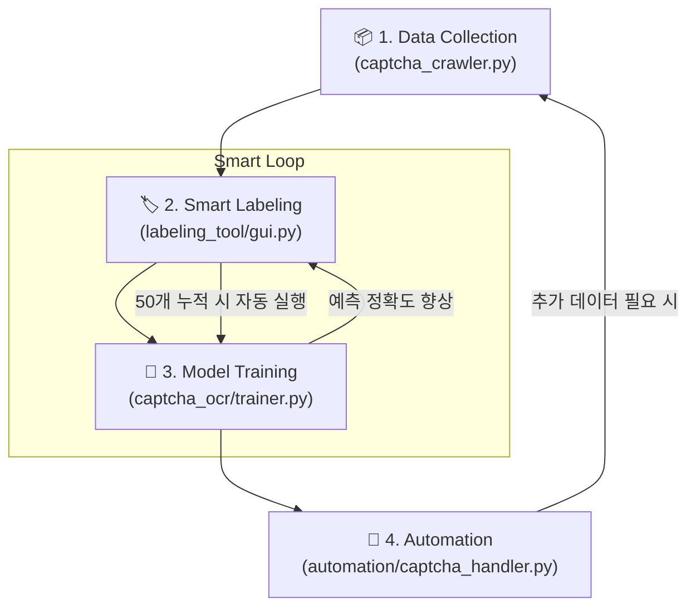

# Project Workflow & Active Learning Loop

이 문서는 인터파크 CAPTCHA OCR 프로젝트의 전체적인 동작 흐름과 데이터 선순환 구조(Active Learning)를 설명합니다.

---

## 🔄 Overall Pipeline

프로젝트는 크게 4단계의 반복적인 사이클로 구성됩니다.

---

## 📝 Step-by-Step Details

### 1단계: 데이터 수집 (Data Collection)
- `undetected_chromedriver`를 사용해 인터파크 로그인 및 대상 페이지 접속.
- CAPTCHA 이미지를 대량으로 크롤링하여 `data/raw` 폴더에 타임스탬프 이름으로 저장.

### 2단계: 스마트 라벨링 (Smart Labeling)
- **Active Learning의 핵심**:
    - **초기 상태**: 학습된 모델이 없을 때는 `EasyOCR`의 예측값을 참고하여 라벨링 진행.
    - **숙련 상태**: 학습된 내 모델(`captcha_model.onnx`)이 생기면 내 모델의 예측값을 우선 표시.
- 사용자는 틀린 부분만 수정하여 `Enter`를 누르면 `data/labeled`로 이동 및 `labels.csv` 기록.

### 3단계: 모델 학습 (Incremental Training)
- 새로운 라벨링 데이터가 **50개 이상** 쌓이면 백그라운드에서 `OCRTrainer`가 자동으로 실행됨.
- 기존 가중치를 바탕으로 전이 학습(Transfer Learning)을 수행하여 모델의 정확도를 점진적으로 개선.
- 최종적으로 최적화된 `ONNX` 모델을 내보냄.

### 4단계: 매크로 적용 (Service Integration)
- 실제 티켓 예매 프로세스(`main.py`)에서 `CaptchaHandler`가 동작.
- 고도로 학습된 `CaptchaPredictor`를 호출하여 실시간으로 CAPTCHA를 해결 (~50ms).

---

## 🎯 핵심 가치: Why Active Learning?

1. **라벨링 효율 극대화**: 처음부터 끝까지 사람이 치는 것이 아니라, 모델의 예측을 "검수"하는 수준으로 작업 부하 감소.
2. **데이터 품질 향상**: 모델이 헷갈려 하는 특정 패턴을 사용자가 집중적으로 교정 가능.
3. **빠른 배포**: 최소한의 데이터(50개)로 시작하여 서비스를 돌리면서 점점 더 똑똑해지는 모델 구축 가능.
